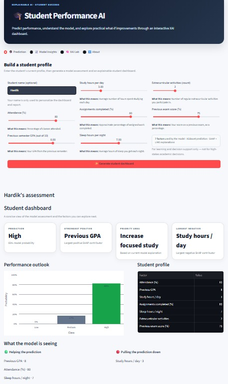
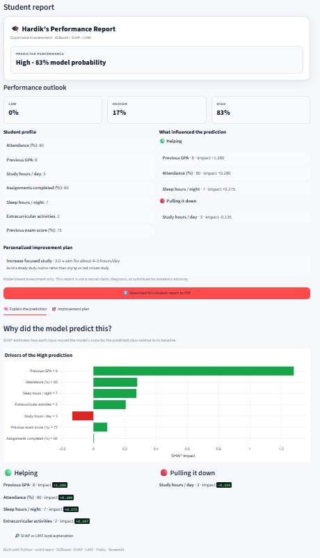
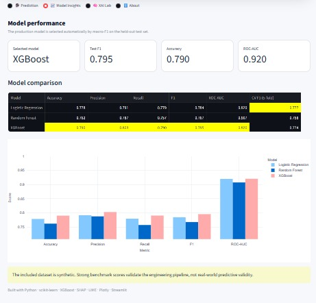

# 🎓 Explainable Student Performance AI

> An end-to-end Explainable AI application that predicts student performance, explains individual predictions with **SHAP + LIME**, and turns model explanations into actionable **what-if scenarios** through an interactive Streamlit dashboard.

[](https://www.python.org/)
[](https://streamlit.io/)
[](https://xgboost.readthedocs.io/)
[](https://shap.readthedocs.io/)
[](https://github.com/marcotcr/lime)
[](https://github.com/features/actions)
[](#-license)

## 🔗 Links

- 💻 **GitHub Repository:** `https://github.com/HardikJain1011/Explainable-Student-Performance-AI/`
- 🚀 **Live Demo:** `https://explainable-student-performance-ai.streamlit.app/`

> 🚧 **Project Status:** Portfolio-ready prototype. The application has been tested locally and is ready for GitHub/Streamlit deployment.

---

## 📸 Application Preview

### Student Dashboard

The student-facing workflow collects an academic/lifestyle profile and produces a performance prediction, probability breakdown, model explanations, improvement suggestions, and what-if scenarios.



### Student Performance Report

The application generates a personalized report containing the predicted performance, probability outlook, profile, influential features, and an improvement plan.



### Model Performance

The model insights section compares Logistic Regression, Random Forest, and XGBoost using multiple evaluation metrics.




---

## 🚀 Why This Project Stands Out

This is **not just a classification notebook**.

It combines:

- Machine learning model development
- Model comparison and evaluation
- Explainable AI
- Local and global interpretability
- SHAP + LIME explanations
- Permutation feature importance
- Counterfactual / what-if analysis
- Actionable recommendation generation
- Interactive Streamlit product design
- PDF report generation
- Responsible-AI communication
- GitHub Actions CI

The goal is to demonstrate the complete workflow from **data → model → explanation → actionable insight → user-facing application**.

---

## ✨ Features

### 🎓 Student Dashboard

- Student profile input
- Low / Medium / High performance prediction
- Prediction probability visualization
- Profile snapshot
- Strongest positive model contributors
- Priority improvement area
- Personalized improvement suggestions
- Counterfactual what-if simulations
- Downloadable PDF performance report

### 🤖 Machine Learning

The application compares:

- Logistic Regression
- Random Forest
- XGBoost

The training pipeline includes:

- Stratified train/test split
- 5-fold cross-validation
- Accuracy
- Precision
- Recall
- Macro-F1
- ROC-AUC
- Automatic best-model selection using macro-F1

### 🔍 Explainable AI

- Local SHAP feature attribution
- Global SHAP analysis
- Local LIME explanations
- Permutation feature importance
- Feature dependence plots
- Human-readable explanation cards

### 💡 Actionable XAI

The project separates **explanation** from **recommendation**.

**SHAP answers:**

> Which inputs pushed the current prediction up or down?

The recommendation layer then considers reasonably actionable factors such as attendance, study hours, assignment completion, sleep and extracurricular load.

The what-if engine tests plausible combinations of changes and checks whether those changes alter the trained model's predicted class.

These are explicitly presented as **model simulations, not causal claims**.

---

## 🧠 How Explainability Works

### SHAP

SHAP estimates how individual features contribute to a model prediction relative to a baseline.

For example:

```text
Higher attendance  → may push prediction upward
Higher study time  → may push prediction upward
Lower study time   → may push prediction downward
```

The application visualizes these contributions so that the prediction is not presented as a black-box class label.

### LIME

LIME provides a second local explanation by approximating model behaviour around an individual prediction.

Using both SHAP and LIME provides a useful cross-check between two local explanation approaches.

### Permutation Importance

Permutation importance provides an additional global feature-importance perspective and helps compare feature reliance against SHAP-based global explanations.

### Counterfactual / What-If Analysis

The application explores plausible changes to actionable inputs and checks whether those changes alter the model's prediction.

For example:

```text
What if attendance increased?
What if study hours increased?
What if assignment completion improved?
```

The result answers:

> Would the trained model change its predicted class under these modified inputs?

This is a **model-based simulation**, not a guarantee that making the suggested change will cause the same real-world outcome.

---

## 🏗️ Architecture

```text
                    ┌─────────────────────┐
                    │   Student Profile   │
                    └──────────┬──────────┘
                               │
                               ▼
                    ┌─────────────────────┐
                    │  Trained ML Models  │
                    │  LR / RF / XGBoost  │
                    └──────────┬──────────┘
                               │
                    Prediction + Probabilities
                               │
              ┌────────────────┴────────────────┐
              ▼                                 ▼
       ┌──────────────┐                  ┌──────────────┐
       │     SHAP     │                  │     LIME     │
       │ local/global │                  │ local check  │
       └──────┬───────┘                  └──────┬───────┘
              └────────────────┬────────────────┘
                               ▼
                    ┌─────────────────────┐
                    │ Actionable XAI Layer│
                    │ Recommendations     │
                    │ + Counterfactuals   │
                    └──────────┬──────────┘
                               ▼
             ┌──────────────────────────────────┐
             │ Streamlit Student Dashboard     │
             │ + Downloadable PDF Report       │
             └──────────────────────────────────┘
```

---

## 📊 Input Features

| Feature | Description |
|---|---|
| Attendance | Attendance percentage |
| Previous GPA | Previous academic GPA |
| Study Hours | Average study hours per day |
| Assignments Completed | Percentage of assignments completed |
| Sleep Hours | Average sleep duration per night |
| Extracurriculars | Number of extracurricular activities |
| Previous Exam Score | Previous examination score |

### Target Classes

The model predicts:

- 🟢 **High**
- 🟡 **Medium**
- 🔴 **Low**

---

## 📈 Current Benchmark

The current benchmark selects **XGBoost as the best-performing model based on macro-F1**.

| Model | Accuracy | Macro F1 | ROC-AUC |
|---|---:|---:|---:|
| Logistic Regression | 0.778 | 0.784 | 0.920 |
| Random Forest | 0.762 | 0.767 | 0.908 |
| **XGBoost** | **0.790** | **0.795** | **0.921** |

The bundled training artifacts also contain additional evaluation metrics including precision, recall, and cross-validation results.

> **Important:** These results are benchmark results on a held-out split of the included **synthetic dataset**. They demonstrate the ML/XAI engineering workflow and should **not** be interpreted as evidence of real-world academic prediction accuracy.

---

## 🗂️ Project Structure

```text
Explainable-Student-Performance-AI/
│
├── app.py
├── README.md
├── requirements.txt
├── .gitignore
├── LICENSE
│
├── assets/
│   ├── dashboard.png
│   ├── student-report.png
│   └── model-performance.png
│
├── data/
│   └── student_data.csv
│
├── models/
│   ├── all_models.joblib
│   ├── metrics.csv
│   ├── meta.json
│   ├── X_train.csv
│   ├── X_test.csv
│   └── y_test.csv
│
├── src/
│   ├── __init__.py
│   ├── data.py
│   ├── train.py
│   ├── explain.py
│   ├── recommendations.py
│   └── report.py
│
├── reports/
│
└── .github/
    └── workflows/
        └── ci.yml
```

---

## ⚙️ Run Locally

### 1. Clone the repository

```bash
git clone YOUR_GITHUB_REPOSITORY_URL
cd Explainable-Student-Performance-AI
```

### 2. Create a virtual environment

**Windows:**

```powershell
python -m venv .venv
.venv\Scripts\activate
```

**macOS / Linux:**

```bash
python -m venv .venv
source .venv/bin/activate
```

### 3. Install dependencies

```bash
pip install -r requirements.txt
```

### 4. Launch the application

```bash
streamlit run app.py
```

The application will open in your browser.

---

## 🔄 Retrain the Models

```bash
python -m src.train
```

The training pipeline regenerates the synthetic data and writes the model artifacts to `models/`.

> **Note:** Retraining may produce slightly different results depending on the implementation and random seeds. The benchmark table describes the currently bundled trained artifacts.

---

## ☁️ Deploy with Streamlit Community Cloud

1. Push the repository to GitHub.
2. Open Streamlit Community Cloud.
3. Connect your GitHub account.
4. Select this repository.
5. Set `app.py` as the application entry point.
6. Deploy.

The repository includes trained model artifacts so the application can start without retraining.

After deployment, add the live URL to the **Links** section at the top.

---

## 🧪 Continuous Integration

The repository includes a GitHub Actions workflow for continuous integration.

The workflow helps verify that the project remains importable/compilable when changes are pushed.

Future testing improvements can include:

- Unit tests for preprocessing
- Tests for model prediction functions
- Tests for SHAP/LIME helpers
- Counterfactual recommendation tests
- Streamlit smoke tests
- End-to-end application tests

---

## 🤖 Responsible AI & Limitations

This project is an educational and portfolio-oriented prototype for demonstrating
machine learning and Explainable AI techniques in student performance prediction.

### Important limitations

- The dataset used in this project is **synthetic** and does not represent real students.
- The model predictions should not be treated as official academic assessments.
- Predictions are probabilistic and may contain uncertainty or bias.
- SHAP and LIME explanations describe how the model arrived at a prediction; they do
  not establish that a feature causally affects student performance.
- Recommendations generated by the system are suggestions rather than guaranteed
  interventions.
- The system should not be used as the sole basis for consequential educational
  decisions.
- A real-world deployment would require validation using appropriately collected,
  representative data and review by relevant educational stakeholders.

### Privacy

The application is designed as a demonstration system and does not require real
student records. Users should not enter personally identifiable or sensitive
student information into a public deployment.

If the application is extended to process real student data, appropriate privacy,
security, consent, data-retention, and institutional requirements must be
addressed before deployment.

---

## 🚀 Future Improvements

- Replace synthetic data with a real, consented educational dataset
- Add probability calibration and confidence intervals
- Expand fairness evaluation across appropriate groups
- Add data and model drift monitoring
- Add authentication and privacy-preserving storage
- Add experiment tracking with MLflow or Weights & Biases
- Expand automated test coverage
- Add a production API using FastAPI
- Add Docker-based deployment
- Add model versioning and experiment reproducibility
- Add richer counterfactual optimization
- Add monitoring dashboards for deployed models

---

## 💼 Resume-Ready Description

### Explainable Student Performance AI
**Python · XGBoost · Scikit-learn · SHAP · LIME · Streamlit · Plotly**

- Built an end-to-end multiclass ML application comparing Logistic Regression, Random Forest and XGBoost, achieving **0.787 macro-F1** and **0.919 ROC-AUC** on a held-out synthetic benchmark.
- Implemented **SHAP and LIME** for local/global model interpretability and cross-checked feature importance using permutation importance.
- Developed an actionable XAI layer that converts model attributions into personalized improvement suggestions and **counterfactual what-if simulations**.
- Built an interactive **Streamlit dashboard** with probability visualizations, student-facing explanations and downloadable PDF performance reports.

> Replace “Built” with “Deployed” only after the application is actually live.

---

## 🧑‍💻 Skills Demonstrated

**Machine Learning:** classification, model comparison, cross-validation, XGBoost, evaluation metrics, feature importance

**Explainable AI:** SHAP, LIME, permutation importance, local/global explanations, counterfactual analysis

**Python & Data:** Python, Pandas, NumPy, Scikit-learn, Joblib

**Product & Deployment:** Streamlit, Plotly, PDF generation, Git, GitHub, GitHub Actions

**Responsible AI:** explainability limitations, non-causal interpretation, synthetic-data disclosure, fairness, privacy, model monitoring

---

## 📌 Project Workflow

```text
Data
  ↓
Model Training
  ↓
Model Comparison
  ↓
Best Model Selection
  ↓
Prediction
  ↓
SHAP + LIME
  ↓
Actionable Recommendations
  ↓
Counterfactual What-If Analysis
  ↓
Interactive Student Dashboard
  ↓
Downloadable Report
```

The emphasis is not only on **making predictions**, but also on making those predictions **interpretable, actionable, and responsibly communicated**.

---

## 📄 License

This project is licensed under the **MIT License**.

See the `LICENSE` file for details.

---

## ⭐ If You Find This Project Useful

If this project helped you understand Explainable AI, machine learning interpretability, or Streamlit-based ML applications, consider giving the repository a ⭐ on GitHub.
